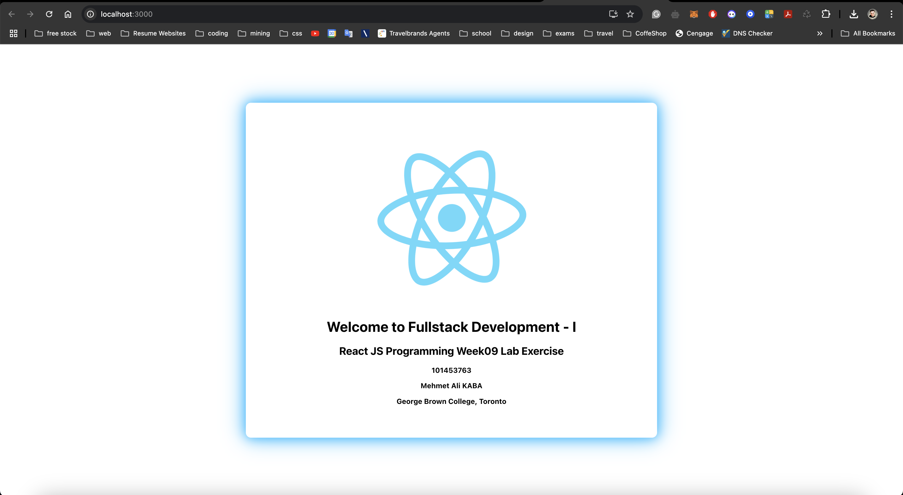

# Comp3123 Lab9 - ReactJS Week09 Lab Exercise

This repository contains the source code for the Lab Week 09 exercise for the Fullstack Development - I course at George Brown College.

## Task Instructions

1. **Verify Node.js installation**
   Ensure Node.js is installed by executing the following command:

   ```
   $ node --version
   ```

2. **Create a new ReactJS application**
   Use the following command to create the application:

   ```
   $ npx create-react-app labweek09
   ```

3. **Run the application**
   Navigate to the project folder and start the development server:

   ```
   $ cd labweek09
   $ npm start
   ```

## Exercise Description

In this exercise, you need to update the default layout to display the following information using the state or props object:

- Student ID: **101453763**
- Name: **Mehmet Ali KABA**
- College: **George Brown College, Toronto**

## Screenshot

Below is a screenshot of the running application:



## Repository Link

[GitHub Repository](https://github.com/kabamehmetali/Comp3123_Lab9)

---

### Created by Mehmet Ali KABA
